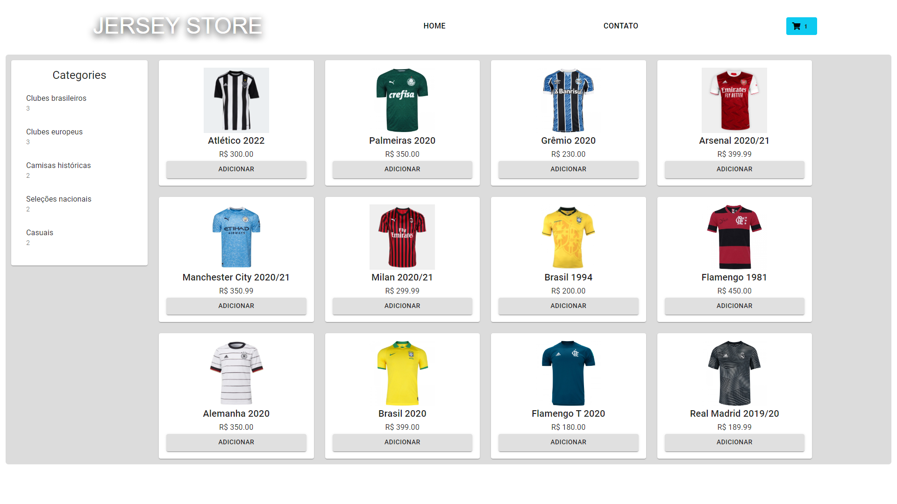

# E-commerce Jersey Store
E-commerce example made for DIO Bootcamp.

Front end made using React.js and Typescript, showing how to control component states in the application.

Back end made using Node.js , Typescript, Express and TypeORM.

